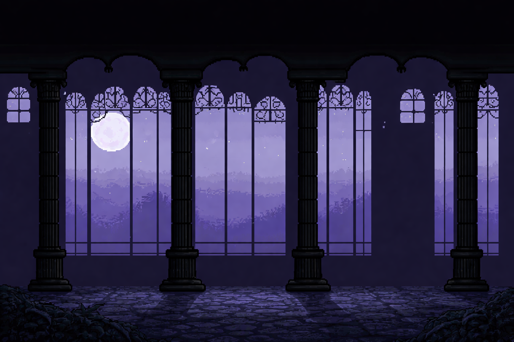
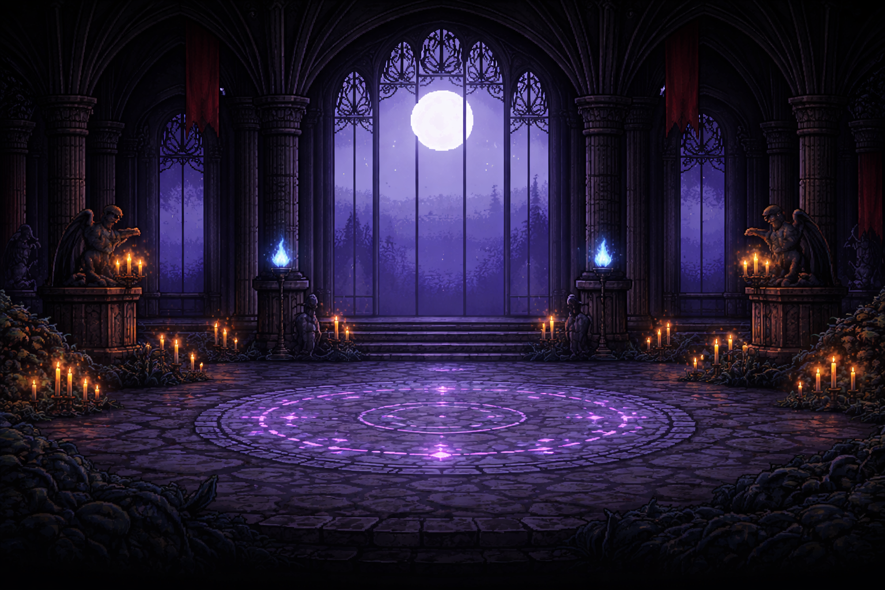

# NightHill

<p align="center">
  
</p>

<p align="center">
  <a href="https://github.com/xSahil9999/Nighthill"></a>
  <a href="https://github.com/xSahil9999/Nighthill/commits/main"></a>
  <a href="https://github.com/xSahil9999/Nighthill"></a>
</p>

## About The Project
NightHill ist mein eigenes Lernprojekt in Python/Pygame.  
Ich habe den Kern selbst gebaut und ein YouTube-Tutorial als Hilfe genutzt, um Struktur, Game-Loop und Animationen besser zu lernen.

Die Assets wurden von itch.io geladen, von mir angepasst und im Projekt zusammengesetzt.  
Story, Level-Folge und Gameplay-Idee sind von mir.

## World Preview
<p align="center">
  
  
</p>

## Features
- 4 Level mit Progression und Boss-Fight
- Player mit Run, Jump und 3-Hit Combo Attack
- NPC-Dialoge, die den Spielfluss steuern
- Gegner-KI mit Patrol, Aggro und Nahkampf
- Respawn-Logik und Level-spezifische Regeln

## Tech Stack


## Controls
| Action | Key |
|---|---|
| Move left | `A` |
| Move right | `D` |
| Jump | `W` or `Space` |
| Attack | `Left Click` or `J` |
| NPC interaction | `E` |
| Respawn (if dead) | `R` |

## Run Locally
```bash
pip install pygame
python main.py
```

## Creator Note
Das Projekt ist bewusst kompakt und als Lernbasis gebaut.  
Aktuell entwickle ich ein neues Spiel, das auf den Erfahrungen aus NightHill basiert.

## Connect
- GitHub: [xSahil9999](https://github.com/xSahil9999)

## GitHub Snake
<picture>
  <source media="(prefers-color-scheme: dark)" srcset="https://raw.githubusercontent.com/xSahil9999/Nighthill/output/github-snake-dark.svg" />
  <source media="(prefers-color-scheme: light)" srcset="https://raw.githubusercontent.com/xSahil9999/Nighthill/output/github-snake.svg" />
  
</picture>
